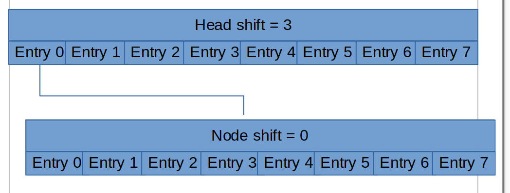
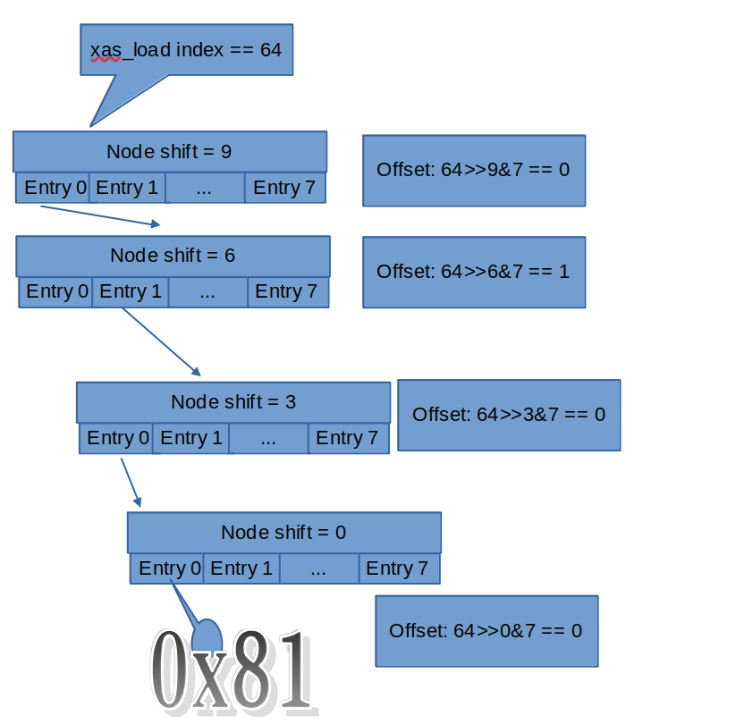

# Study on Linux XArray

The XArray is an abstract data type which behaves like a very large array of pointers. It meets many of the same needs as a hash or a conventional resizable array [1].

Radix tree was previously  used in page cache for searching page caches. However, after version 4.20 of the Linux kernel, it has been replaced by the XArray structure.

## Structure of XArray 



In include/linux/xarray.h there are macro definitions about node of XArray:
```
#define XA_CHUNK_SIZE           (1UL << XA_CHUNK_SHIFT)
#define XA_CHUNK_MASK           (XA_CHUNK_SIZE - 1)
```
In figure above, XA_CHUNK_SHIFT is defined to be 3, and XA_CHUNK_SIZE is defined to be 1<<3 = 8, and XA_CHUNK_MASK is defined to be 8 - 1 = 7. So there are 8 slots per XArray node.

## Example of xas_load

Above figure gives a example of XArray tree traverse:

The head node of the tree has shift 9, so when we try to load index 64th element from the tree,
we compute the offset first:
```
203	static void *xas_descend(struct xa_state *xas, struct xa_node *node)
204	{
205		unsigned int offset = get_offset(xas->xa_index, node);
206		void *entry = xa_entry(xas->xa, node, offset);
207	
208		xas->xa_node = node;
```
The offset at the head node of our current search is 0, and the offset at the second level node (shift == 6) is 1,
and the offset at the third level node (shift == 3) is 0, and the offset at the leaf node (shift == 0) is 0.

## Conclusion


## references
[1] https://www.kernel.org/doc/html/latest/core-api/xarray.html
