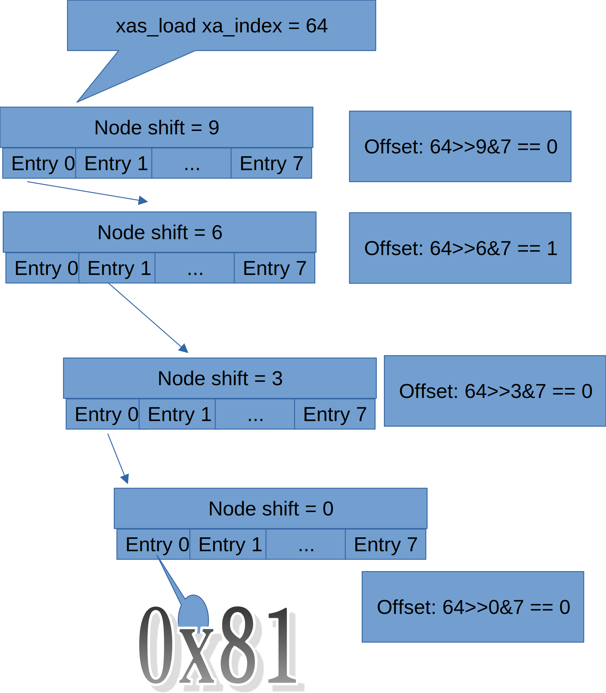

# Study on Linux XArray

The XArray is an abstract data type which behaves like a very large array of pointers. It meets many of the same needs as a hash or a conventional resizable array [1].

Radix tree was previously  used in page cache for searching page caches. However, after version 4.20 of the Linux kernel, it has been replaced by the XArray structure.

## 1. Structure of XArray 


In include/linux/xarray.h there are macro definitions about node of XArray:
```
#define XA_CHUNK_SIZE           (1UL << XA_CHUNK_SHIFT)
#define XA_CHUNK_MASK           (XA_CHUNK_SIZE - 1)
```
In figure above, XA_CHUNK_SHIFT is defined to be 3, and XA_CHUNK_SIZE is defined to be 1<<3 = 8, and XA_CHUNK_MASK is defined to be 8 - 1 = 7. So there are 8 slots per XArray node.

## 2. Example of xas_load



Above figure gives a example of XArray tree traverse:

The head node of the tree has shift 9, so when we try to load index 64th element from the tree,
we compute the offset first:
```
203	static void *xas_descend(struct xa_state *xas, struct xa_node *node)
204	{
205		unsigned int offset = get_offset(xas->xa_index, node);
206		void *entry = xa_entry(xas->xa, node, offset);
207	
208		xas->xa_node = node;
```
* The offset at the head node of our current search is computed as 0, so we got the pointer to next node we travel from slot 0
* The offset at the second level node (shift == 6) is computed as 1, so we got the pointer to next node we travel from slot 1
* The offset at the third level node (shift == 3) is computed as 0, so we got the pointer to next node we travel from slot 1 and
* The offset at the leaf node (shift == 0) is computed 0, so we got the entry from slot 0.

## 3. Multi-order Xarray
Much like her ancestor radix-tree in Linux kernel [2], Xarray has multi-order technology to
insert an entry that covers multiple indices and have operations on indices in that range.

We will visit the structure of Multi-order Xarray from easiest to hardest cases in this section

### 3.1 Index == 0 and order is multiple of XA_CHUNK_SHIFT


In figure above, we store entry 1 with order 12 and index 10 to Xarray, so:
* A node with shift == 12 is allocated and is assigned as header
* Value 1 is stored to slot 1 of above node.

### 3.2 Index=4004 and order=7


As mentioned in [2], "For orders greater than 1, there can 
simply be multiple sibling entries that all point back to 
the actual radix-tree entry".

Note in the figure \ref{mylabel}, 7th entry of node with shift-6 is
a sibling node that point back to 6th entry of the same node. Both 6th
and 7th entries represent indices of order 6 (1<<6), and they formed
together the index combinations of order 7.
 

## 4. Conclusion


## 5. references
[1] https://www.kernel.org/doc/html/latest/core-api/xarray.html

[2] https://lwn.net/Articles/688130/
