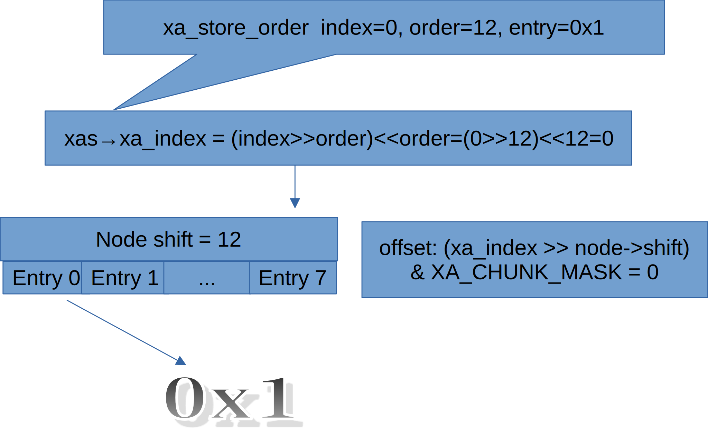

# Study on Linux XArray

The XArray is an abstract data type which behaves like a very large array of pointers. It meets many of the same needs as a hash or a conventional resizable array [1].

Radix tree was previously  used in page cache for searching page caches. However, after version 4.20 of the Linux kernel, it has been replaced by the XArray structure.

## 1. Structure of XArray 


In include/linux/xarray.h there are macro definitions about node of XArray:
```
#define XA_CHUNK_SIZE           (1UL << XA_CHUNK_SHIFT)
#define XA_CHUNK_MASK           (XA_CHUNK_SIZE - 1)
```
In figure above, XA_CHUNK_SHIFT is defined to be 3, and XA_CHUNK_SIZE is defined to be 1<<3 = 8, and XA_CHUNK_MASK is defined to be 8 - 1 = 7. So there are 8 slots per XArray node.

## 2. Example of xas_load


Above figure gives a example of XArray tree traverse:

The head node of the tree has shift 9, so when we try to load index 64th element from the tree,
we compute the offset first:
```
203	static void *xas_descend(struct xa_state *xas, struct xa_node *node)
204	{
205		unsigned int offset = get_offset(xas->xa_index, node);
206		void *entry = xa_entry(xas->xa, node, offset);
207	
208		xas->xa_node = node;
```
* The offset at the head node of our current search is computed as 0, so we got the pointer to next node we travel from slot 0
* The offset at the second level node (shift == 6) is computed as 1, so we got the pointer to next node we travel from slot 1
* The offset at the third level node (shift == 3) is computed as 0, so we got the pointer to next node we travel from slot 1 and
* The offset at the leaf node (shift == 0) is computed 0, so we got the entry from slot 0.

## 3. Multi-order Xarray
Much like her ancestor radix-tree in Linux kernel [2], Xarray has multi-order technology to
insert an entry that covers multiple indices and have operations on indices in that range.

We will visit the structure of Multi-order Xarray from easiest to hardest cases in this section

### 3.1 Index == 0 and order is multiple of XA_CHUNK_SHIFT


In figure above, we store entry 1 with order 12 and index 10 to Xarray, so:
* A node with shift == 12 is allocated and is assigned as header
* Value 1 is stored to slot 1 of above node.

### 3.2 Index=4004 and order=7

<div>
    {#fig:multiorder1}
</div>


As mentioned in [2], "For orders greater than 1, there can 
simply be multiple sibling entries that all point back to 
the actual radix-tree entry".

Note in the figure @fig:{multiorder1}, 7th entry of node with shift-6 is
a sibling node that point back to 6th entry of the same node. Both 6th
and 7th entries represent indices of order 6 (1<<6), and they formed
together the index combinations of order 7.
 
## 4. Marks
In XArray data structure, each entry (see figures above) in the array has three bits associated with it called marks [3].

### 4.1 Marks' use case in Linux kernel
In Linux kernel's function mark_buffer_dirty, __folio_mark_dirty is called to mark folio's
corresponding indices in mapping dirty.
```
2666		xa_lock_irqsave(&mapping->i_pages, flags);
2667		if (folio->mapping) {	/* Race with truncate? */
2668			WARN_ON_ONCE(warn && !folio_test_uptodate(folio));
2669			folio_account_dirtied(folio, mapping);
2670			__xa_set_mark(&mapping->i_pages, folio_index(folio),
2671					PAGECACHE_TAG_DIRTY);
2672		}
2673		xa_unlock_irqrestore(&mapping->i_pages, flags);
```

### 4.2 Set mark example


<p style="text-align: center;">{#fig:set_mark1}</p>

In figure @fig:{set_mark1}, we want to set mark: XA_MARK_0 in index 64 of XArray. Following is the mark process.

* The head of the array is a node with shift == 6, so to keep traversing, offset is computed as 64>>6&7==1.
* Entry 1 of head is a node with shift == 3, and the next offset is computed as 64>>3&7 == 0.
* Entry 0 of previous node is a node with shift = 0, and the offset is computed as 64>>0&7 == 0, so mark0[offset] is set.
* Traverse back the tree from above node to head, and set mark0[offset] of each node.

## 5. xas_split

xas_split is added in [4] to support spliting a multi-index entry (eg if a file is truncated in
the middle of a huge page entry) [4].

### 5.1 xas_split example 1


<p style="text-align: center;">{#fig:xassplit1}</p>

In figure @fig:{xassplit1}, the new_order for split is 1, which means each entry in the array has one sibling (1<<1 == 2). the "order" to be splited is 2, which means there are 4 (1<<2) to be splitted.

### 5.2 xas_split example 2

The second example of xas_split is from Linux kernel, when we invoke
```
echo 1 > /sys/kernel/debug/split_huge_pages
```
Linux kernel calls split_huge_pages_all => split_folio => split_folio_to_list => split_huge_page_to_list => xas_split to split
a multi-index entry in memory map
```
2762				xas_split(&xas, folio, folio_order(folio));
```


<p style="text-align: center;">{#fig:xassplit2}</p>

Note that in Linux kernel, there are 64 entries in a XArray node.
In figure above, xas_split traverse the XArray from head (with shift 12) all
the way down to the node with shift 6, then replace the content of entry 2 (offset = 2)
which is folio with a new node of shift 0.

And the mark of old entry will be set on all entries of the new child node, as green square and green arrow in above
figure indicates.
```
1054 void xas_split(struct xa_state *xas, void *entry, unsigned int order)
...
1066         marks = node_get_marks(node, xas->xa_offset);
...
1069         do {
1070                 if (xas->xa_shift < node->shift) {
...
1080                         node_set_marks(node, offset, child, marks);
```

Then split_huge_pages_all => split_folio => split_folio_to_list => split_huge_page_to_list => __split_huge_page stores the
splited pages one by one to above figure.
```
2541         for (i = nr - 1; i >= 1; i--) {
...
2555                         __xa_store(&head->mapping->i_pages, head[i].index,
2556                                         head + i, 0);
```


After __xa_store, the XArray will looks like following figure:


<p style="text-align: center;">{#fig:xassplit3}</p>

## 6. xas_for_each
The xas_for_each() is a macro used to iterate over the present entries in the XArray [3]. It is defined in include/linux/xarray.h
```
1770 #define xas_for_each(xas, entry, max) \
1771         for (entry = xas_find(xas, max); entry; \
1772              entry = xas_next_entry(xas, max))
```
xas_find is used to find the next present entry in the XArray, If the xas has not yet been walked to an entry, return the entry which has an index >= xas.xa_index.  If it has been walked, the entry currently being pointed at has been processed, and so we move to the next entry [5].

xas_next_entry is used to advance iterator to next present entry. It is an inline function to optimise xarray traversal for
speed.  It is equivalent to calling xas_find(), and will call xas_find() for all the hard cases [6].

### 6.1 xas_for_each example

Following example is from Linux kernel, when we delete a file from filesystem (XFS), page_cache_delete_batch  
will be called to remove the folios (combination of pages) from page mapping:
```
288		xas_for_each(&xas, folio, ULONG_MAX) {
289                 if (i >= folio_batch_count(fbatch))
290                         break;
...
314                 xas_store(&xas, NULL);
315                 total_pages += folio_nr_pages(folio);
316         }
```


<p style="text-align: center;">{#fig:xasforeach1}</p>

In this example, xas_for_each iterate over the XArray (mapping->pages) for folio_batch_count of entires, and erase them during the iterating.

In figure above, because the folios in XArray are of order 2, echo folio occupies 4 slots in the leaf node.

During xas_for_each's iterating, when it encounters a sibling entry or zero entry, it will forwards to next entry
until a non zero and non sibling entry is found.

```
1237 void *xas_find(struct xa_state *xas, unsigned long max)
...
1273                 if (entry && !xa_is_sibling(entry))
1274                         return entry;
```

## 7. Conclusion


## 8. references
[1] https://www.kernel.org/doc/html/latest/core-api/xarray.html

[2] https://lwn.net/Articles/688130/

[3] https://docs.kernel.org/core-api/xarray.html

[4] XArray: add xas_split https://patchwork.kernel.org/project/linux-mm/patch/20201016024156.AmjHOFeMg%25akpm@linux-foundation.org/

[5] https://git.kernel.org/pub/scm/linux/kernel/git/torvalds/linux.git/tree/lib/xarray.c

[6] https://git.kernel.org/pub/scm/linux/kernel/git/torvalds/linux.git/tree/include/linux/xarray.h
